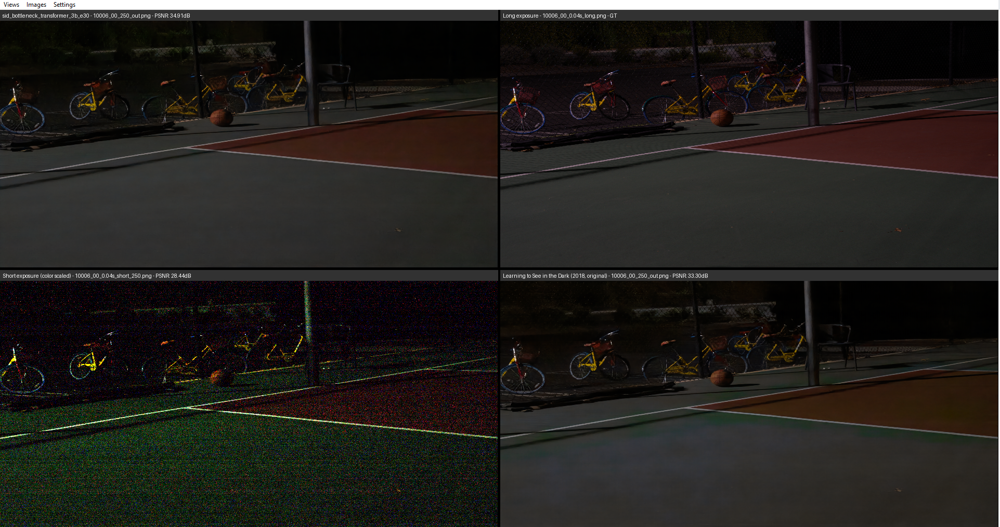

# Image Comparison Tool

A Python application for comparing four images simultaneously with advanced navigation and analysis features.

## Features

- **Quad View Comparison**: Display and compare four images side-by-side
- **Flexible Folder Selection**: Load images from four different directories
- **Automated Grouping**: Automatically group images by filename prefixes
- **Interactive Navigation**:
  - Mouse scroll to zoom in/out
  - Click and drag to pan images
  - Arrow keys to navigate between image groups
- **Ground Truth Analysis**: Designate one view as ground truth and display comparison metrics

## Screenshot

## Installation

### Prerequisites
- Python 3.7 or higher
- pip (Python package manager)

### Dependencies
Install required packages:
`pip install -r requirements.txt`

The application requires the following packages:
- NumPy
- Pillow (PIL)

## Usage

### Launching the Application
python main.py

### Basic Workflow

1. **Select Folders**:
   - Click the *Views* buttons to select four directories containing your images
   - Each folder corresponds to one of the four image views

2. **Image Grouping**:
   - Images are automatically grouped by filename prefix
   - Adjust prefix length in *Settings* to control grouping sensitivity

3. **Navigation**:
   - Use left/right arrow keys to move between image groups
   - Scroll to zoom in/out on any image view
   - Click and drag to pan around zoomed images

4. **Labels**:
   - If a folder contains a `label.txt` file, its content will be displayed above the image
   - Otherwise, the folder name is used as the label

5. **Ground Truth Comparison**:
   - In *Settings*, designate one view as the ground truth
   - Comparison metrics will be displayed for each image relative to the ground truth

## Contributing

Contributions are welcome! Please feel free to submit pull requests or open issues for bugs and feature requests.

## License

This project is licensed under the MIT License - see the LICENSE file for details.

**Note**: This application is designed for research and comparison purposes. Ensure you have appropriate rights to view and compare the images loaded into the application.